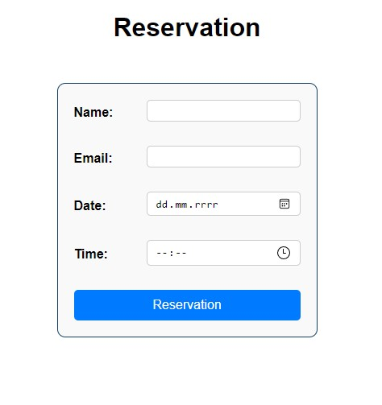

#  Flask Reservation System



A simple web application for managing reservations with email confirmation. Built using Flask, SQLite, and HTML templates.

##  Features

- Submit reservations via a web form  
- Check for time slot availability  
- Store reservations in a local SQLite database  
- Send confirmation emails to users  
- Admin interface to view all reservations

##  Project Structure

```
reservation_system/ 
├── app.py              # Main application file 
├── reservations.db     # SQLite database 
├── requirements.txt    # List of dependencies
├── mail_password.env   # Environment file for email password 
├── static/ 
│ └── style.css         # CSS styling 
├── templates/ 
│ ├── index.html        # Main reservation page 
│ └── admin.html        # Admin dashboard 
└── .venv/              # Virtual environment
```


##  Installation

**Clone the repository**

   ```bash
   git clone https://github.com/your-username/reservation_system.git
   cd reservation_system
   ```
   

## Create a virtual environment

   ```bash
   python -m venv .venv

  # Linux/macOS
  source .venv/bin/activate

  # Windows
  .\.venv\Scripts\activate
  ```
  
## Install dependencies

   ```bash
   pip install -r requirements.txt
  ```

## Email Setup
To enable email confirmations, create a file named mail_password.env in the root directory and add:

```
MAIL_PASSWORD=your_app_password

```
Replace "your_email" in send_email() inside app.py with your actual Gmail address. Make sure you use an App Password if you have 2FA enabled on your Gmail account.

## Running the App
Start the application with:

  ```bash
  python app.py
  Then open your browser and go to:

  http://127.0.0.1:5000/
 ```


## Admin Interface
To view all reservations, visit:
 ```
 http://127.0.0.1:5000/admin
 ```

## Dependencies
The app uses the following Python packages:

```
 Flask==3.1.1

 Jinja2==3.1.6

 Werkzeug==3.1.3

 click==8.2.1

 colorama==0.4.6

 blinker==1.9.0

 itsdangerous==2.2.0

 MarkupSafe==3.0.2

 python-dotenv==1.1.1
```

These are listed in requirements.txt and can be installed via pip.
